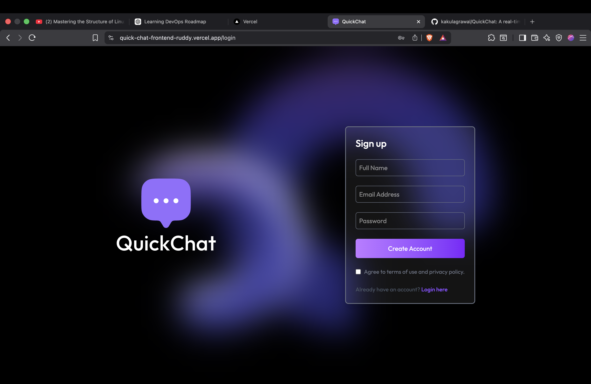
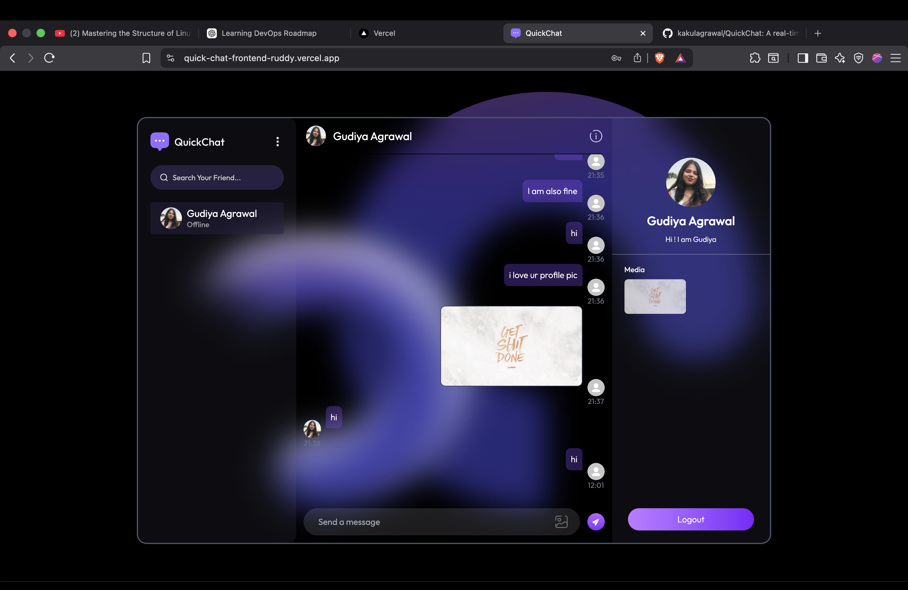
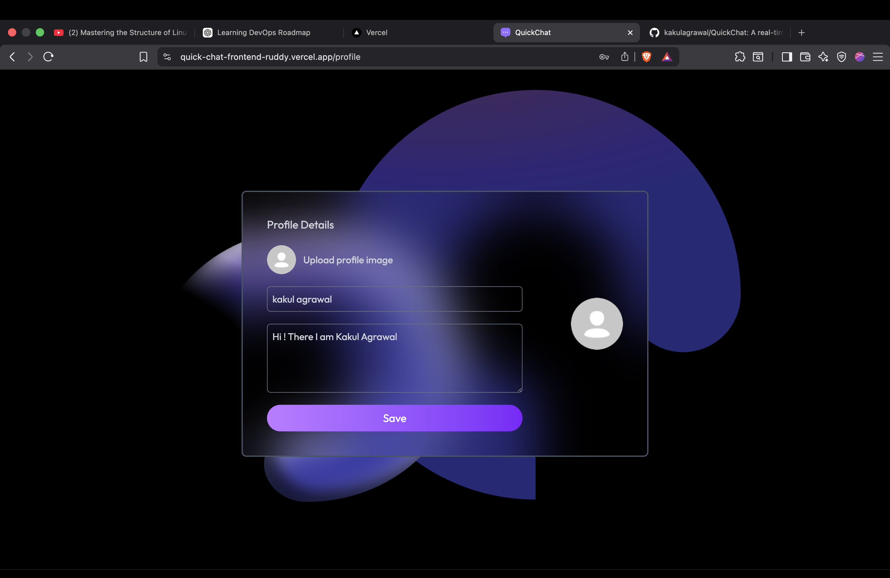
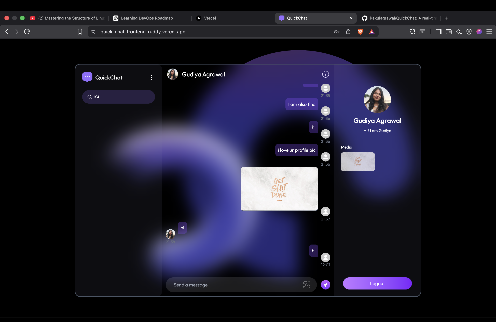

# 💬 QuickChat - Real-Time Chat Application

QuickChat is a full-stack real-time messaging application built using the MERN stack. It enables users to communicate instantly through a modern and responsive interface with secure authentication and real-time message delivery.

## ✨ Features

### 👤 User Features

* 🔐 Secure user authentication
* 💬 Real-time one-to-one messaging
* 🟢 Online/offline user status
* 📷 Profile picture support
* 🔍 Search users and conversations
* 📱 Responsive design for desktop and mobile
* ⚡ Instant message delivery
* 🎨 Clean and modern user interface

## 🛠️ Tech Stack

### Frontend

* React
* Vite
* Tailwind CSS
* Axios
* React Router DOM

### Backend

* Node.js
* Express.js
* MongoDB
* Mongoose
* JWT Authentication
* Socket.IO
* Cloudinary

## 📂 Project Structure

```text
QuickChat
├── frontend
│   ├── src
│   ├── public
│   └── package.json
│
└── backend
    ├── config
    ├── controllers
    ├── middleware
    ├── models
    ├── routes
    ├── socket
    └── package.json
```

## 🚀 Getting Started

### 1. Clone the Repository

```bash
git clone <repository-url>
cd QuickChat
```

### 2. Install Dependencies

#### Frontend

```bash
cd frontend
npm install
```

#### Backend

```bash
cd ../backend
npm install
```

## ⚙️ Environment Variables

Create a `.env` file inside the backend directory.

```env
PORT=5000

MONGODB_URI=YOUR_MONGODB_URI

JWT_SECRET=YOUR_SECRET_KEY

CLOUDINARY_CLOUD_NAME=YOUR_CLOUD_NAME
CLOUDINARY_API_KEY=YOUR_API_KEY
CLOUDINARY_API_SECRET=YOUR_API_SECRET
```

## ▶️ Run the Project

### Start Backend

```bash
cd backend
npm run dev
```

### Start Frontend

```bash
cd frontend
npm run dev
```

## 🌐 Live Demo

* **Live Website:** https://quick-chat-frontend-ruddy.vercel.app/login

## 📸 Screenshots

Add screenshots of:

* Signup Page
  
  
* Chat Interface
  
  
* User Profile
  
  
* Search Filter
  
  

## 🔮 Future Improvements

* 👥 Group chats
* 📞 Voice and video calling
* 😊 Emoji picker
* 📎 File and document sharing
* 🔔 Push notifications
* 🌙 Dark mode
* ✍️ Typing indicators
* ✔️ Read receipts

## 👨‍💻 Author

**Kakul Agrawal**

Passionate Full Stack Developer focused on building scalable web applications and continuously learning new technologies.

## ⭐ Support

If you found this project helpful, consider giving it a ⭐ on GitHub!
